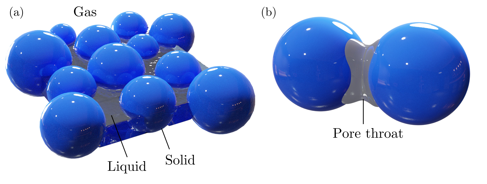
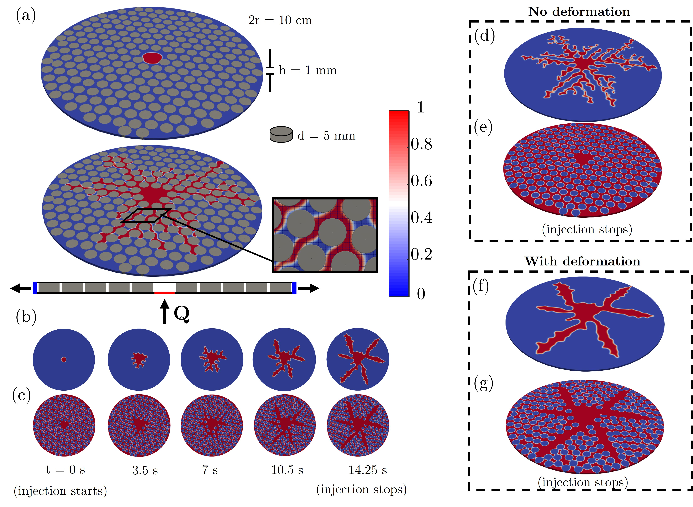
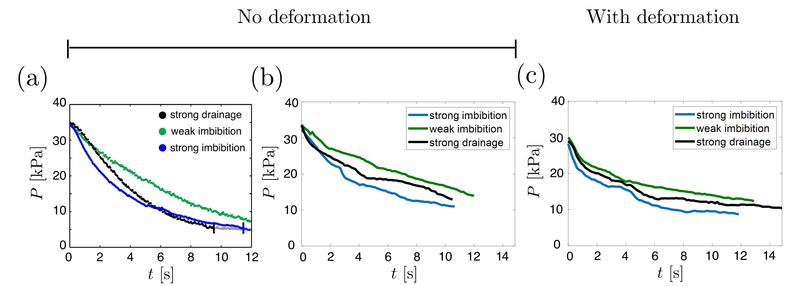

### Prerequisites

- [OpenFOAM](https://openfoam.org/) (recommended: v5.x or compatible)
- [CFDEMproject](https://github.com/CFDEMproject/CFDEMcoupling-PUBLIC)
- C++ compiler (GCC recommended)
- Linux environment

### Build Instructions

1. Clone this repository and the CFDEMproject sources.
2. Set up OpenFOAM and CFDEMproject environment variables.
3. Navigate to the solver directory:
    ```sh
    cd cfdemSolverIB_VOF
    wmake
    ```
4. The executable will be created in your user application directory.

### Running Simulations

1. Prepare your case directory with mesh, initial fields, and configuration files.
2. Running the solver:
    ```sh
    cfdemSolverIB_VOF
    ```
3. Post-process results using OpenFOAM utilities or ParaView.

---

## Documentation & Figures

- The main algorithm is described in [Paper.pdf](Paper.pdf).
- Example figures and validation results are provided below:

  
**FIG. 1.** (a) Schematic 3-phase system. (b) Wetting phase demonstration.

  
**FIG. 2.** Computational domain with solid particles and resolved CFD mesh. Snapshots show volume and void fractions at different simulation times and conditions.

  
**FIG. 3.** Injection pressure evolution for resolved method cases: (a) experiments, (b) simulations without deformation, (c) simulations with deformation.

---

## Reference

- Davydzenka, T., et al. "Coupled fine-scale modeling of the wettability effects: Deformation and fracturing." *Physics of Fluids* 32, 083308 (2020). [Link](https://aip.scitation.org/doi/10.1063/5.0018455)
- [CFDEMproject Documentation](https://github.com/CFDEMproject/CFDEMcoupling-PUBLIC)

---

## License

This project is licensed under the GNU General Public License v3.0. See [LICENSE](https://www.gnu.org/licenses/gpl-3.0.html) for details.